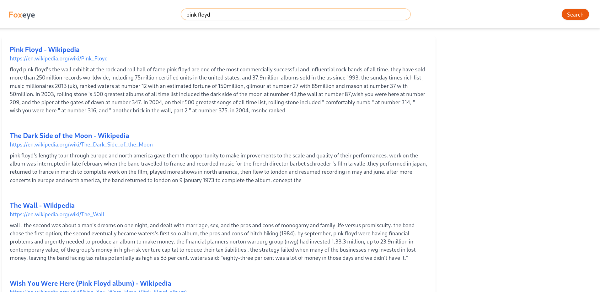
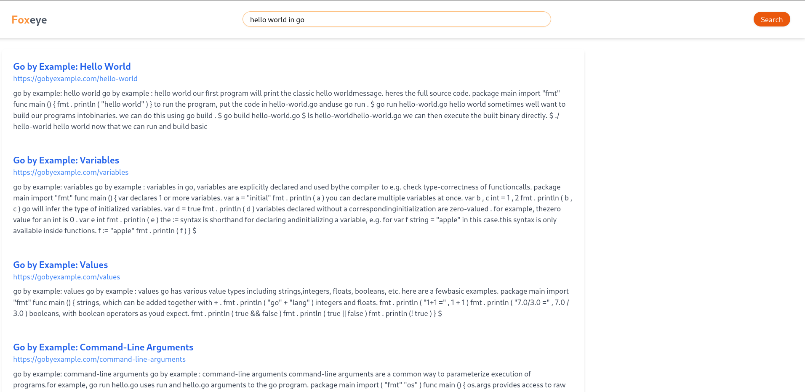
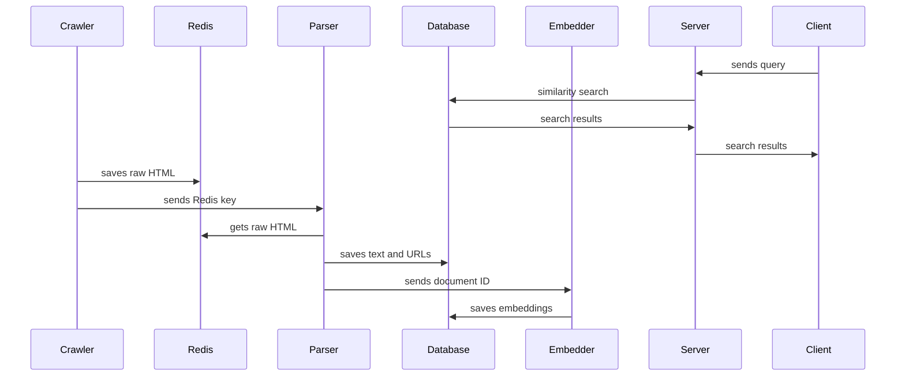

# Foxeye (Major Project)
### search engine written in rust 

## About
Foxeye is a university project, it is made with high focus being on learning part, it's not perfect, but it works

Foxeye uses rust for almost everything except web ui, it uses [WhereIsAI/UAE-Large-V1](https://huggingface.co/WhereIsAI/UAE-Large-V1) model
to generate embeddings

## FLow

foxeye consists of different modules that are :-

- Crawler
- Parser
- Embedder
- Search
- Db (lib)
- Utils (lib)
- Client (web ui)

basic flow of foxeye goes like this

crawler loads configured website and their robots.txt and starts crawling sites,
it uses set of rules to figure if it is ok to crawl once all rules pass it crawls site and save raw html in redis and send its id to parser using rabbit mq

once parser gets the id it parses the raw html, extract text and urls from it, it then saves url and html in database and sends id to embedder
after getting id from embedder it gets document from database using id and splits and embed it depending on model input size

# Screenshots

## Home

## Search

### search results for "Pink Floyd"

### search results for "hello world in Go"

# Sequence Diagram

